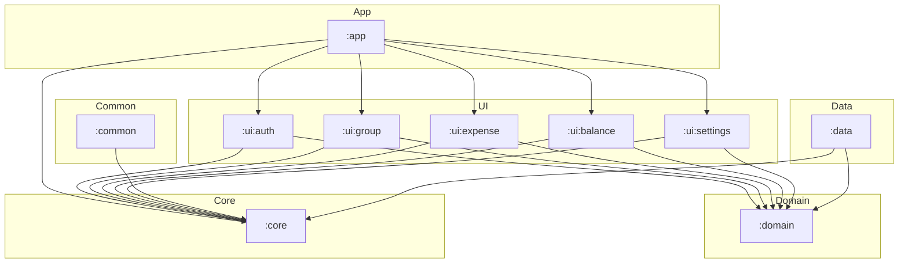

# Module Dependencies (Hexagonal Architecture Style)

## Dependency Table

| Module           | Depends on                 | Notes                                                                                |
|------------------|----------------------------|--------------------------------------------------------------------------------------|
| **:app**         | `:core`, all `:ui:*`       | Entry point, sets up navigation, DI, and ties modules together.                      |
| **:core**        | *(nothing)*                | Android-specific utilities, themes, navigation helpers. No domain logic.             |
| **:domain**      | *(nothing)*                | Pure Kotlin business logic and domain models. Defines repository interfaces (ports). |
| **:data**        | `:domain`, `:core` *(opt)* | Implements domain ports. May use Android SDK if needed.                              |
| **:ui:auth**     | `:domain`, `:core`         | UI for authentication, uses domain ports and Android utilities.                      |
| **:ui:group**    | `:domain`, `:core`         | UI for group management.                                                             |
| **:ui:expense**  | `:domain`, `:core`         | UI for expense tracking.                                                             |
| **:ui:balance**  | `:domain`, `:core`         | UI for balance display.                                                              |
| **:ui:settings** | `:domain`, `:core`         | UI for settings.                                                                     |
| **:common**      | `:core`                    | Shared UI components and Android-specific services.                                  |

---

## Dependency Graph

---

### Key Rules
- **Domain is independent**: no dependencies on Android, Core, Data, or UI.
- **Data depends on Domain**: implements ports defined in Domain.
- **UI depends on Domain**: calls ports, receives domain models.
- **Core** is Android-specific: used by UI and Data, but never by Domain.
