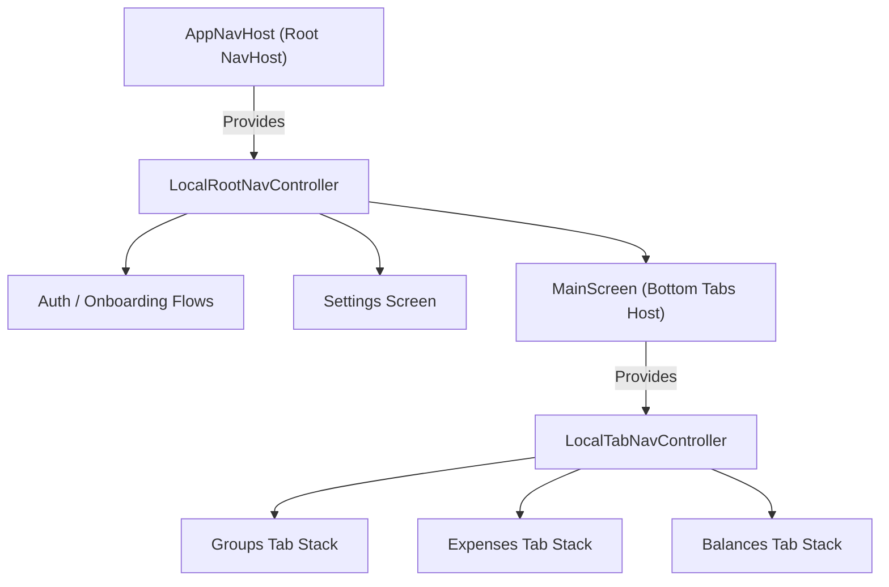

# Navigation & Routing Architecture

This document outlines SplitTrip's navigation architecture, route definitions, controller hierarchy, `NavigationProvider` for bottom tabs, `TabGraphContributor` for non-tab sub-flows, and `ScreenUiProvider` for decoupled Scaffold chrome.

---

## 1. Centralized Route Definitions

The navigation system is string-based and centralized in the **`:core:design-system`** module (`Routes.kt`). This acts as the single source of truth for destination identifiers across all feature modules.

```kotlin
object Routes {
    const val MAIN = "main"
    const val GROUPS = "groups"
    const val EXPENSES = "expenses"
    const val BALANCES = "balances"
    const val SETTINGS = "settings"
    const val SETTINGS_DEFAULT_CURRENCY = "settings_default_currency"
    const val ADD_CONTRIBUTION = "add_contribution"
    const val ADD_CASH_WITHDRAWAL = "add_cash_withdrawal"
    const val MANAGE_SUBUNITS = "manage_subunits"
    const val CREATE_EDIT_SUBUNIT = "create_edit_subunit"
    const val SETTLEMENT_POSITION = "settlement_position"
}
```

---

## 2. Navigation Controllers Hierarchy

The app uses a two-tier nested navigation controller hierarchy provided via `CompositionLocal`.



### 2.1 `LocalRootNavController`
* **Scope:** Global across the entire single-activity application.
* **Provider:** `AppNavHost`.
* **Usage:**
  * Authentication flows (`Login` -> `Onboarding`).
  * Full-screen overlay features that must cover the bottom navigation bar (e.g., Settings, Add Expense full-screen wizard).
  * Global back navigation from modal and leaf screens.

```kotlin
val rootNav = LocalRootNavController.current
rootNav.navigate(Routes.SETTINGS)
```

### 2.2 `LocalTabNavController`
* **Scope:** Local to the currently active tab inside `MainScreen`.
* **Provider:** `MainScreen`.
* **Usage:**
  * Navigation *within* a specific tab stack (e.g., Groups List -> Group Detail).
  * Preserves the back stack of each tab independently across tab switches.

```kotlin
val tabNav = LocalTabNavController.current
tabNav.navigate(Routes.GROUP_DETAIL)
```

---

## 3. Tab Features & `NavigationProvider`

Top-level tabs (such as Groups, Expenses, Balances) register dynamically with `MainScreen` using the `NavigationProvider` interface.

```kotlin
interface NavigationProvider {
    val route: String
    val icon: NavigationBarIcon
    val labelResId: Int
    val order: Int
    fun buildGraph(builder: NavGraphBuilder)
}
```

### DI Registration
Each tab feature module binds its `NavigationProvider` implementation in Koin:

```kotlin
factory { GroupsNavigationProviderImpl(get()) } bind NavigationProvider::class
```

`MainScreen` injects all registered `NavigationProvider` instances, orders them by `order`, and dynamically builds the bottom navigation tabs and nested navigation graphs without hardcoded dependencies.

---

## 4. Non-Tab Features & `TabGraphContributor`

Some features are **standalone write-flows or sub-flows** extracted into their own isolated modules, but navigated to from within an existing tab stack (keeping the tab navigation context). These modules implement `TabGraphContributor` instead of `NavigationProvider`.

### How It Works
1. The non-tab module implements `TabGraphContributor` to register its composable destinations into a `NavGraphBuilder`.
2. The module registers its contributor in Koin:
   ```kotlin
   factory { ContributionsTabGraphContributorImpl() } bind TabGraphContributor::class
   ```
3. The host tab's `NavigationProvider` injects all `TabGraphContributor` instances and invokes `contributeGraph(builder)` inside its `buildGraph()`.

### Route Ownership Matrix

| Route | Feature Module | Host Tab | Contributor |
|---|---|---|---|
| `Routes.ADD_CONTRIBUTION` | `:features:contributions` | Balances | `ContributionsTabGraphContributorImpl` |
| `Routes.ADD_CASH_WITHDRAWAL` | `:features:withdrawals` | Balances | `WithdrawalsTabGraphContributorImpl` |
| `Routes.SETTLEMENT_POSITION` | `:features:settlements` | Balances | `SettlementsTabGraphContributorImpl` |
| `Routes.MANAGE_SUBUNITS` | `:features:subunits` | Groups | `SubunitsTabGraphContributorImpl` |
| `Routes.CREATE_EDIT_SUBUNIT` | `:features:subunits` | Groups | `SubunitsTabGraphContributorImpl` |

The host tab navigates to these routes via `LocalTabNavController.current.navigate(Routes.ADD_CONTRIBUTION)`. There is **zero compile-time dependency** between feature modules.

---

## 5. Decoupled Chrome: `ScreenUiProvider`

The `ScreenUiProvider` pattern decouples top app bars and bottom main action buttons (FABs / CTAs) from the screen content and `MainScreen`'s root Scaffold.

### 5.1 The Interface
```kotlin
interface ScreenUiProvider {
    val route: String
    val topBar: (@Composable () -> Unit)? get() = null
    val mainAction: MainAction? @Composable get() = null
}
```

### 5.2 Usage Patterns

* **Tab screens** (Groups, Expenses, Balances): Use inline typographic headers inside their scrollable lists instead of a top app bar. Their `ScreenUiProvider` declares only `route` and optional `mainAction`:
  ```kotlin
  class ExpensesScreenUiProviderImpl(
      override val route: String = Routes.EXPENSES
  ) : ScreenUiProvider
  ```

* **Non-tab screens** (write-flows, sub-flows): Use `DynamicTopAppBar` with title, subtitle, and back navigation:
  ```kotlin
  class SubunitManagementScreenUiProviderImpl(
      override val route: String = Routes.SUBUNIT_MANAGEMENT
  ) : ScreenUiProvider {
      override val topBar: @Composable () -> Unit = {
          DynamicTopAppBar(
              title = stringResource(R.string.subunit_management_title),
              subtitle = stringResource(R.string.subunit_management_subtitle)
          )
      }
  }
  ```

> [!IMPORTANT]
> **No Placeholder Actions:** The `actions` block in `DynamicTopAppBar` must ONLY contain `IconButton`s with functional `onClick` handlers. If an action (search, filter) is not yet implemented, omit the parameter entirely.

### 5.3 DI & Consumption in `MainScreen`
All `ScreenUiProvider` instances are registered as `single` in Koin and collected in `MainScreen`:

```kotlin
val providers: List<ScreenUiProvider> = getKoin().getAll()
val currentProvider = providers.find { it.route == currentRoute }

Scaffold(
    topBar = { currentProvider?.topBar?.invoke() },
    bottomBar = {
        BottomNavigationBar(
            selectedRoute = selectedRoute,
            onTabSelected = { selectedRoute = it },
            items = visibleProviders,
            mainAction = currentProvider?.mainAction
        )
    }
) { innerPadding ->
    // Active tab NavHost content
}
```
