# Architecture Diagrams

Visual guide to the ExpenseShareApp architecture using Mermaid diagrams. Each section covers a key aspect of the system — from high-level module structure down to individual data flows and patterns.

---

## Table of Contents

1. [Module Dependency Graph](#1-module-dependency-graph)
2. [Clean Architecture Layers](#2-clean-architecture-layers)
3. [Feature Module Anatomy](#3-feature-module-anatomy)
4. [DI Wiring (Koin)](#4-di-wiring-koin)
5. [MVI State Management](#5-mvi-state-management)
6. [Feature vs Screen Pattern](#6-feature-vs-screen-pattern)
7. [Navigation Architecture](#7-navigation-architecture)
8. [Offline-First Data Flow — Reads](#8-offline-first-data-flow--reads)
9. [Offline-First Data Flow — Writes](#9-offline-first-data-flow--writes)
10. [Real-Time Multi-Device Sync](#10-real-time-multi-device-sync)
11. [Data Mapping Pipeline](#11-data-mapping-pipeline)
12. [Compose Preview System](#12-compose-preview-system)
13. [Coroutine & Flow Architecture](#13-coroutine--flow-architecture)

---

## 1. Module Dependency Graph

How Gradle modules depend on each other. The `:app` module is the only one that sees everything — it wires DI. Features are fully isolated from each other and from the data layer.

```mermaid
graph TD
    APP[":app<br/><i>DI wiring only</i>"]

    subgraph Core["Core Modules"]
        COMMON[":core:common<br/><i>Constants, UiText,<br/>Providers</i>"]
        DS[":core:design-system<br/><i>UI components, Routes,<br/>NavigationProvider,<br/>TabGraphContributor,<br/>ScreenUiProvider</i>"]
    end

    subgraph Domain["Domain Module"]
        DOM[":domain<br/><i>Models, Repository interfaces,<br/>UseCases, Services</i>"]
    end

    subgraph Data["Data Modules"]
        DATA[":data<br/><i>Repository implementations</i>"]
        LOCAL[":data:local<br/><i>Room DAOs, Entities,<br/>DataStore</i>"]
        FIREBASE[":data:firebase<br/><i>Firestore, Auth</i>"]
        REMOTE[":data:remote<br/><i>Retrofit (Currency API)</i>"]
    end

    subgraph Features["Feature Modules"]
        FG[":features:groups"]
        FE[":features:expenses"]
        FB[":features:balances"]
        FC[":features:contributions"]
        FW[":features:withdrawals"]
        FSU[":features:subunits"]
        FP[":features:profile"]
        FS[":features:settings"]
        FA[":features:authentication"]
        FO[":features:onboarding"]
        FM[":features:main-entry"]
        FL[":features:activity-logging"]
    end

    APP --> Core
    APP --> Domain
    APP --> Data
    APP --> Features

    DS --> COMMON

    DATA --> DOM
    DATA --> LOCAL
    DATA --> FIREBASE
    DATA --> REMOTE
    LOCAL --> DOM
    FIREBASE --> DOM
    REMOTE --> DOM

    FG --> DOM
    FG --> Core
    FE --> DOM
    FE --> Core
    FB --> DOM
    FB --> Core
    FC --> DOM
    FC --> Core
    FW --> DOM
    FW --> Core
    FSU --> DOM
    FSU --> Core
    FP --> DOM
    FP --> Core
    FS --> DOM
    FS --> Core
    FA --> DOM
    FA --> Core
    FO --> Core
    FM --> Core

    style APP fill:#4a9eff,color:#fff
    style DOM fill:#22c55e,color:#fff
    style DATA fill:#f59e0b,color:#fff
    style LOCAL fill:#f59e0b,color:#fff
    style FIREBASE fill:#f59e0b,color:#fff
    style REMOTE fill:#f59e0b,color:#fff
    style COMMON fill:#8b5cf6,color:#fff
    style DS fill:#8b5cf6,color:#fff
```

### Visibility Rules

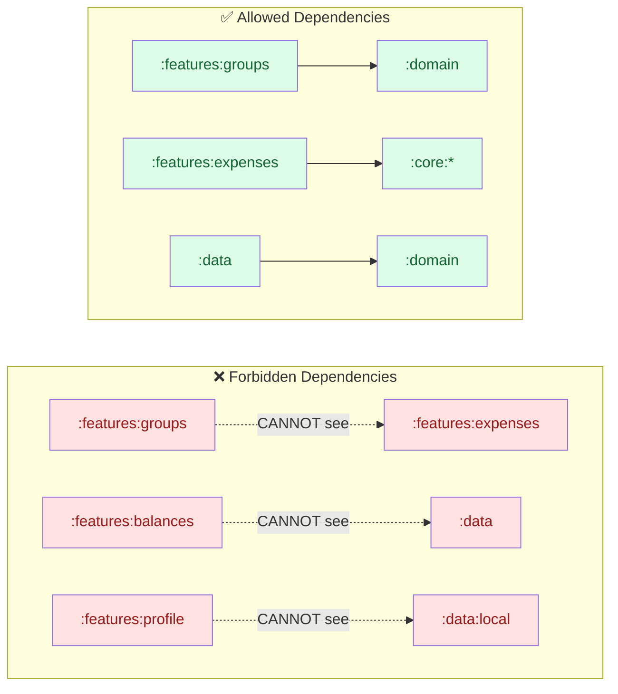

---

## 2. Clean Architecture Layers

The three concentric rings of the architecture, showing dependency direction (always inward).

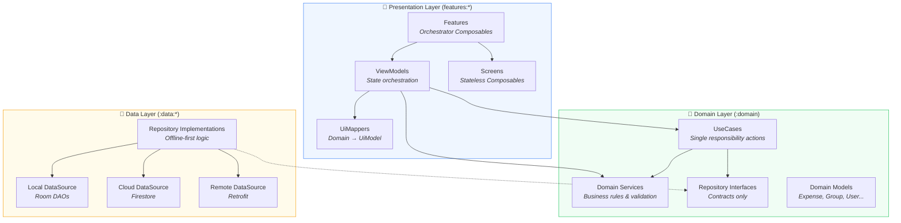

### What Belongs Where

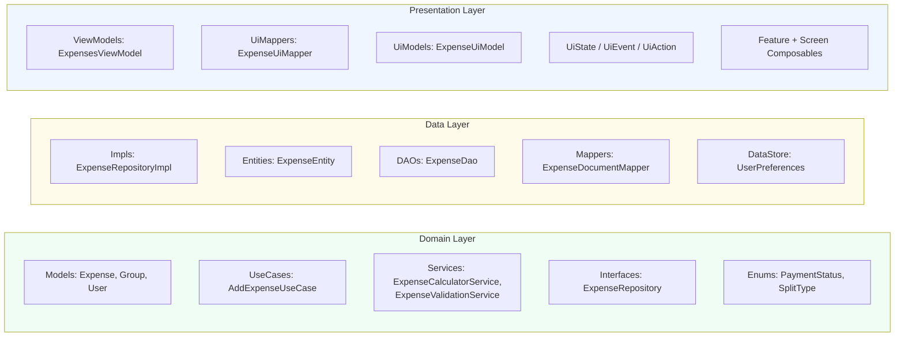

---

## 3. Feature Module Anatomy

Internal structure of a typical feature module (e.g., `:features:groups`).

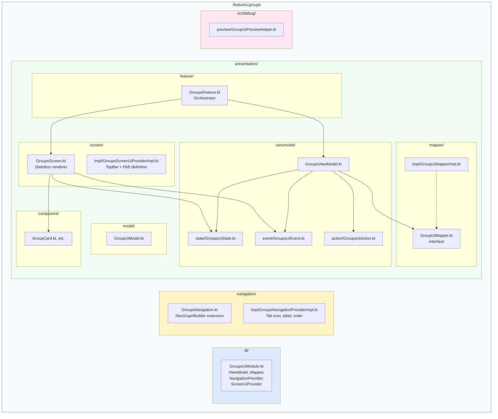

---

## 4. DI Wiring (Koin)

How Koin modules are organized in a triple pattern and aggregated in the `:app` module.

```mermaid
graph TB
    subgraph AppModule["app/.../di/"]
        AGG["FeatureModuleAggregations.kt"]
        DMOD["DataModuleAggregations.kt"]
        AMOD["AppModule.kt"]
    end

    subgraph GroupsTriple["Groups Feature Triple"]
        GD["groupsDomainModule<br/><i>:domain — UseCases</i>"]
        GDA["groupsDataModule<br/><i>:data — Repository impl</i>"]
        GU["groupsUiModule<br/><i>:features:groups — ViewModel,<br/>Mapper, NavProvider,<br/>ScreenUiProvider</i>"]
    end

    subgraph ExpensesTriple["Expenses Feature Triple"]
        ED["expensesDomainModule"]
        EDA["expensesDataModule"]
        EU["expensesUiModule"]
    end

    subgraph SubunitsTriple["Subunits Feature Triple"]
        SUD["subunitsDomainModule"]
        SUDA["subunitsDataModule"]
        SUU["subunitsUiModule<br/><i>:features:subunits — ViewModel,<br/>Mapper, TabGraphContributor</i>"]
    end

    subgraph ContributionsDouble["Contributions Feature (no data module)"]
        CD["contributionsDomainModule"]
        CU["contributionsUiModule<br/><i>:features:contributions — ViewModel,<br/>Mapper, TabGraphContributor</i>"]
    end

    subgraph WithdrawalsDouble["Withdrawals Feature (no data module)"]
        WD["withdrawalsDomainModule"]
        WU["withdrawalsUiModule<br/><i>:features:withdrawals — ViewModel,<br/>Mapper, TabGraphContributor</i>"]
    end

    subgraph DataInfra["Data Infrastructure"]
        DL["dataLocalModule<br/><i>Room DB, DAOs</i>"]
        DF["dataFirebaseModule<br/><i>Firestore, Auth</i>"]
        DR["dataRemoteModule<br/><i>Retrofit</i>"]
        DC["dataCommonModule"]
    end

    subgraph AppProviders["App Providers"]
        LP["LocaleProvider"]
        RP["ResourceProvider"]
        AMP["AppMetadataProvider"]
        IP["IntentProvider"]
    end

    AGG --> GD & GDA & GU
    AGG --> ED & EDA & EU
    AGG --> SUD & SUDA & SUU
    AGG --> CD & CU
    AGG --> WD & WU
    DMOD --> DL & DF & DR & DC
    AMOD --> LP & RP & AMP & IP

    style AppModule fill:#4a9eff,color:#fff
    style GroupsTriple fill:#f0fdf4,stroke:#22c55e
    style ExpensesTriple fill:#f0fdf4,stroke:#22c55e
    style SubunitsTriple fill:#f0fdf4,stroke:#22c55e
    style ContributionsDouble fill:#eff6ff,stroke:#3b82f6
    style WithdrawalsDouble fill:#eff6ff,stroke:#3b82f6
    style DataInfra fill:#fffbeb,stroke:#f59e0b
    style AppProviders fill:#f3e8ff,stroke:#8b5cf6
```

### UI Module Declaration Pattern

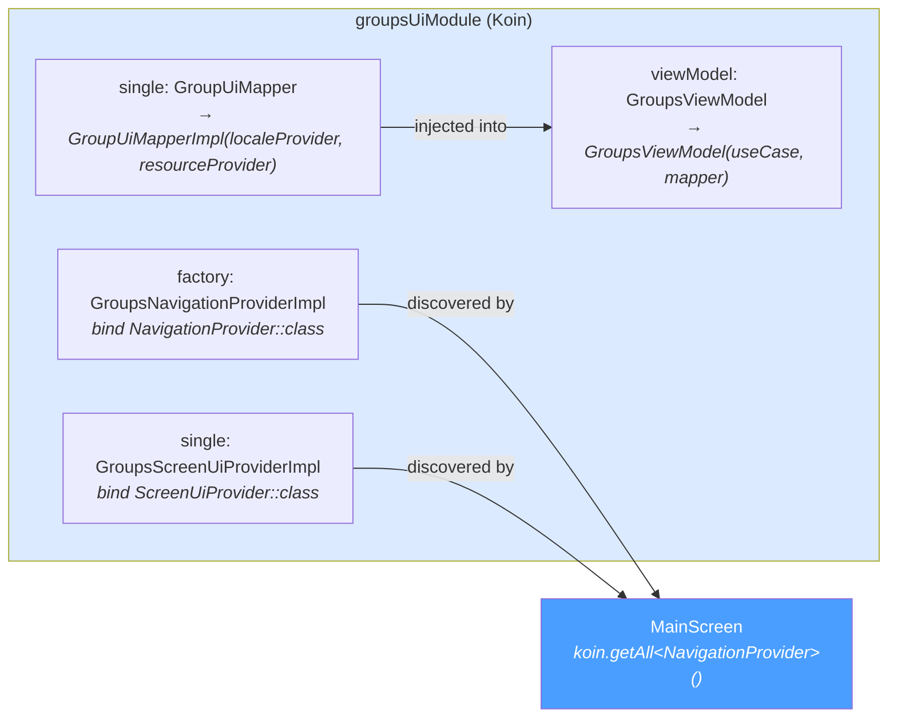

---

## 5. MVI State Management

The triad pattern used by every screen: `UiState`, `UiEvent`, `UiAction`.

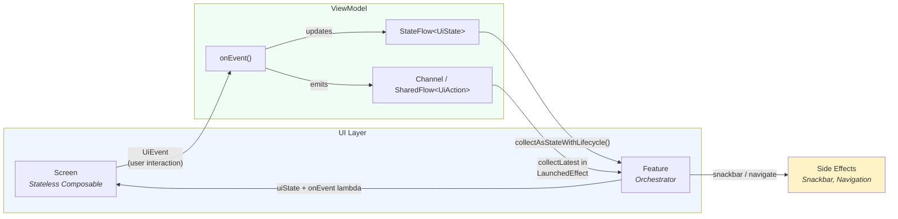

### UiState vs UiAction — When to Use What

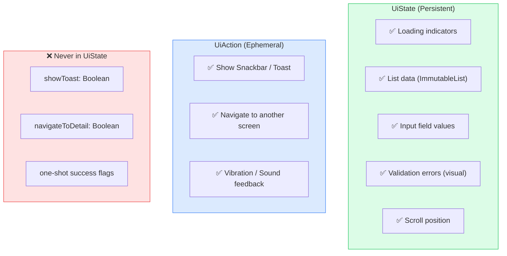

---

## 6. Feature vs Screen Pattern

The separation of orchestration (Feature) from rendering (Screen).

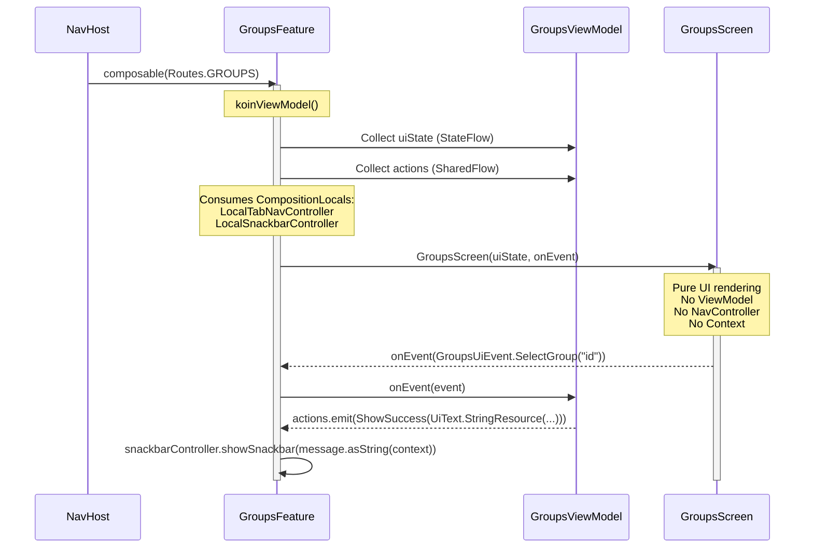

### Why This Pattern Enables Previews

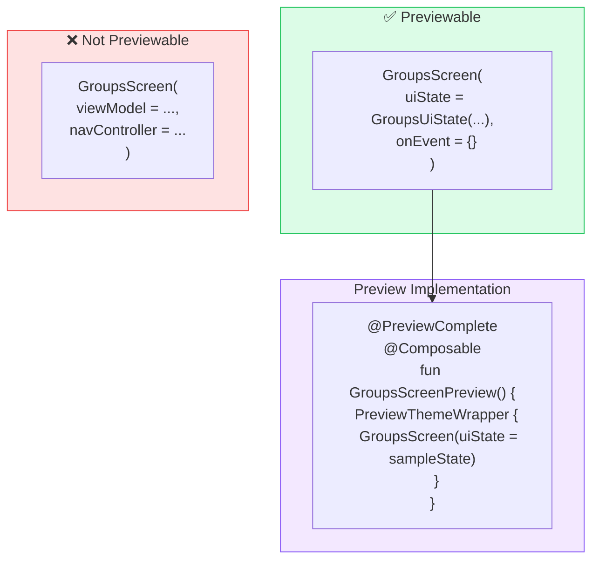

---

## 7. Navigation Architecture

The dual nav-controller system with CompositionLocals.

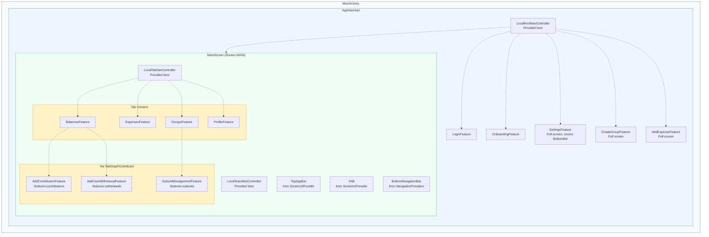

### Navigation Discovery (Plugin Pattern)

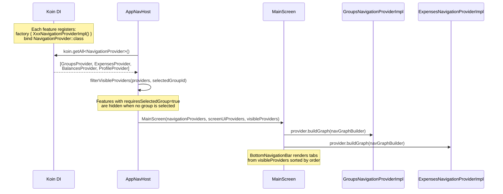

---

## 8. Offline-First Data Flow — Reads

UI always reads from Room. Cloud syncs into Room in the background.

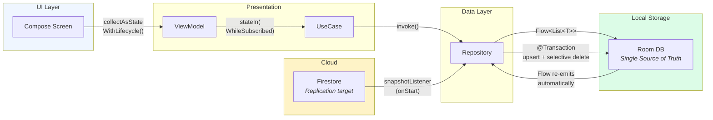

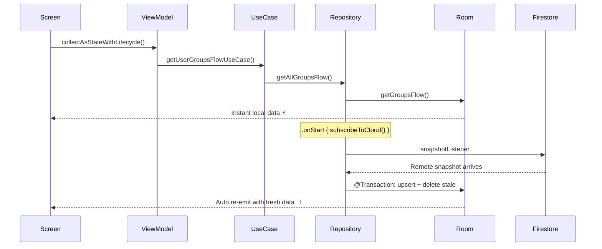

---

## 9. Offline-First Data Flow — Writes

Write locally first, then sync to cloud in the background.

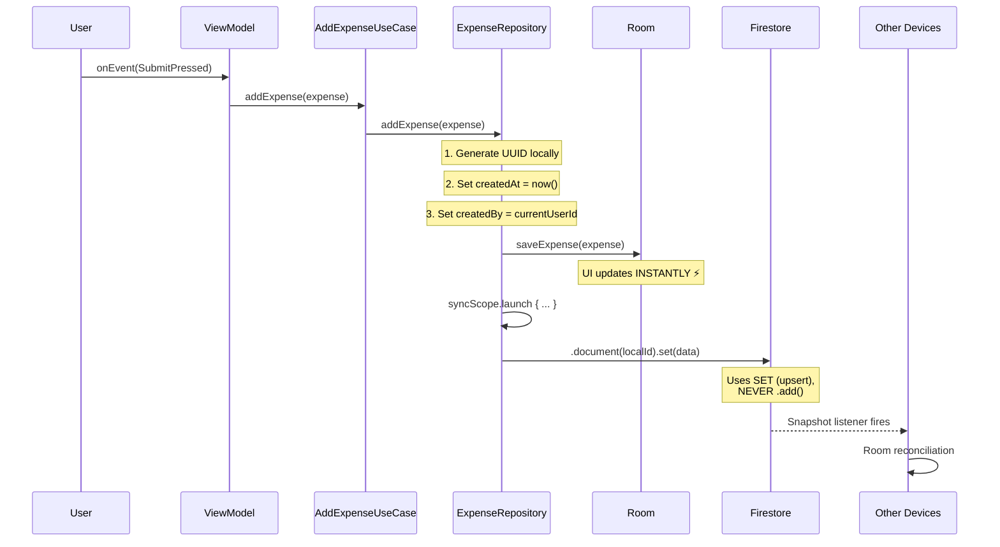

### Write Protocol — Critical Rules

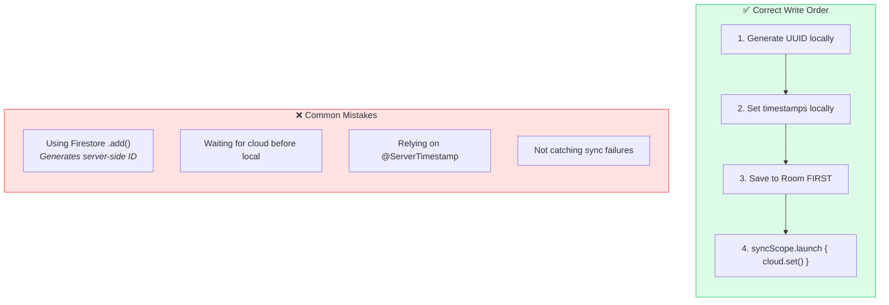

---

## 10. Real-Time Multi-Device Sync

How Firestore snapshot listeners reconcile with Room for multi-user, multi-device updates.

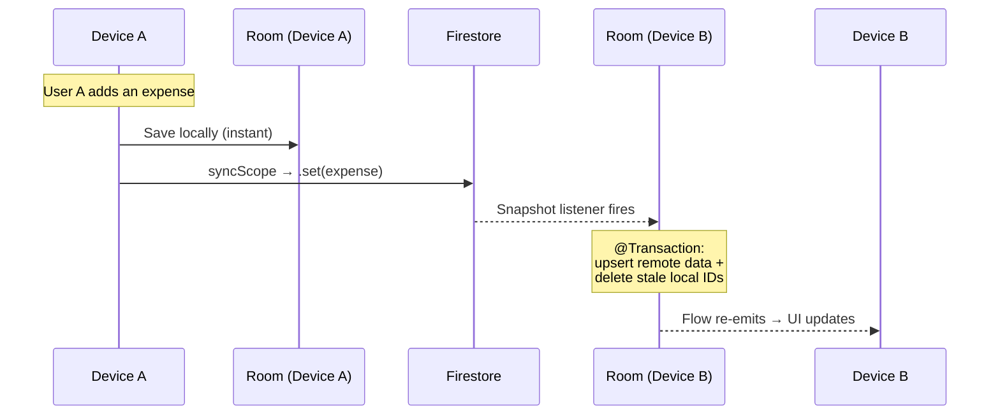

### Room Reconciliation Strategy

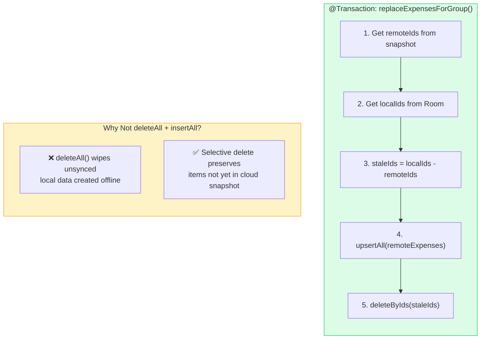

### Cloud Subscription Job Management

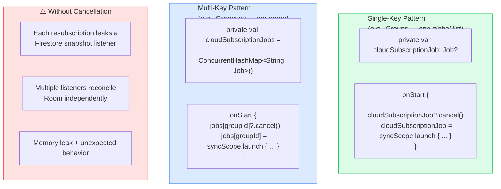

---

## 11. Data Mapping Pipeline

Two-stage mapping: Data → Domain (in `:data`) and Domain → UiModel (in `:features`).

```mermaid
graph LR
    subgraph Cloud["Cloud / Local"]
        FB_DOC["Firestore Document<br/><i>or Room Entity</i>"]
    end

    subgraph DataLayer["Data Layer (:data)"]
        DM["DocumentMapper /<br/>EntityMapper"]
    end

    subgraph DomainLayer["Domain Layer"]
        DOM_OBJ["Domain Model<br/><i>Expense(amountCents=1050,<br/>currency='EUR')</i>"]
    end

    subgraph PresLayer["Presentation Layer (:features)"]
        UI_MAP["UiMapper<br/><i>receives LocaleProvider</i>"]
        UI_MOD["UiModel<br/><i>ExpenseUiModel(<br/>formattedAmount='10.50 €')</i>"]
    end

    subgraph Compose["Compose"]
        SCR2["Screen<br/><i>renders formatted strings</i>"]
    end

    FB_DOC --> DM --> DOM_OBJ --> UI_MAP --> UI_MOD --> SCR2

    style Cloud fill:#fef3c7
    style DataLayer fill:#fffbeb
    style DomainLayer fill:#f0fdf4
    style PresLayer fill:#eff6ff
    style Compose fill:#f3e8ff
```

### Mapper Rules

```mermaid
graph TB
    subgraph Correct["✅ Correct"]
        C1["Mapper receives LocaleProvider"]
        C2["Mapper calls formatShortDate(locale)"]
        C3["Mapper calls formatCurrencyAmount(locale)"]
        C4["ViewModel injects Mapper, not LocaleProvider"]
    end

    subgraph Wrong["❌ Wrong"]
        W1["ViewModel receives LocaleProvider"]
        W2["ViewModel formats dates directly"]
        W3["Screen does string formatting"]
        W4["Passing Context to Mapper"]
    end

    style Correct fill:#dcfce7,stroke:#22c55e
    style Wrong fill:#fee2e2,stroke:#ef4444
```

---

## 12. Compose Preview System

How previews are structured across `src/main` and `src/debug` source sets.

```mermaid
graph TB
    subgraph DebugSourceSet["src/debug (Preview Utilities)"]
        subgraph CorePreview[":core:design-system/src/debug"]
            ANN["@PreviewLocales<br/>@PreviewThemes<br/>@PreviewComplete"]
            PTW["PreviewThemeWrapper"]
            MP["MappedPreview&lt;Domain, UiModel, Mapper&gt;"]
            PLP["PreviewLocaleProvider"]
            PRP["PreviewResourceProvider"]
            PNP["PreviewNavigationProviders"]
        end

        subgraph FeaturePreview[":features:groups/src/debug"]
            HELPER["GroupUiPreviewHelper"]
            PREVIEWS["GroupCardPreviews.kt"]
        end
    end

    subgraph Flow["MappedPreview Flow"]
        direction LR
        DOMAIN["Domain Object<br/><i>(sample data)</i>"]
        MAPPER2["Real Mapper<br/><i>(with preview providers)</i>"]
        UIMOD2["UiModel"]
        RENDER["Preview Composable"]

        DOMAIN --> MAPPER2 --> UIMOD2 --> RENDER
    end

    ANN --> PREVIEWS
    PTW --> PREVIEWS
    MP --> HELPER
    PLP --> MP
    PRP --> MP
    HELPER --> PREVIEWS

    style DebugSourceSet fill:#fce7f3,stroke:#ec4899
    style CorePreview fill:#f3e8ff,stroke:#8b5cf6
    style FeaturePreview fill:#fef3c7,stroke:#f59e0b
    style Flow fill:#f0fdf4,stroke:#22c55e
```

### Preview Annotations — What They Generate

```mermaid
graph LR
    subgraph PL["@PreviewLocales"]
        PL1["EN"]
        PL2["ES"]
    end

    subgraph PT["@PreviewThemes"]
        PT1["Light"]
        PT2["Dark"]
    end

    subgraph PC["@PreviewComplete"]
        PC1["EN Light"]
        PC2["EN Dark"]
        PC3["ES Light"]
        PC4["ES Dark"]
    end

    style PL fill:#dbeafe
    style PT fill:#fef3c7
    style PC fill:#dcfce7
```

---

## 13. Coroutine & Flow Architecture

How flows and dispatchers are managed across layers.

```mermaid
graph TB
    subgraph ViewModelLayer["ViewModel Layer"]
        VMSF["StateFlow via stateIn(<br/>  WhileSubscribed(5000ms, replayExpiration=0),<br/>  initialValue<br/>)"]
        VMCH["Channel&lt;UiAction&gt;<br/><i>or MutableSharedFlow</i>"]
    end

    subgraph DomainUC["UseCase"]
        UCFLOW["Returns Flow&lt;T&gt;<br/><i>from repository</i>"]
    end

    subgraph RepoLayer["Repository"]
        ROOM_FLOW["Room emits Flow&lt;List&lt;T&gt;&gt;"]
        ON_START[".onStart { subscribe cloud }"]
        SYNC_SCOPE["syncScope = CoroutineScope(ioDispatcher)<br/><i>Injected, defaults to Dispatchers.IO</i>"]
    end

    VMSF --> UCFLOW --> ROOM_FLOW
    ROOM_FLOW --> ON_START
    ON_START --> SYNC_SCOPE

    style ViewModelLayer fill:#eff6ff
    style DomainUC fill:#f0fdf4
    style RepoLayer fill:#fffbeb
```

### Testing with Injected Dispatchers

```mermaid
sequenceDiagram
    participant Test as Test Class
    participant Repo as RepositoryImpl
    participant TD as StandardTestDispatcher

    Note over Test: val testDispatcher = StandardTestDispatcher()

    Test->>Repo: RepositoryImpl(..., ioDispatcher = testDispatcher)
    Note over Repo: syncScope = CoroutineScope(testDispatcher)

    Test->>Test: runTest(testDispatcher) { ... }
    Test->>Repo: repo.deleteGroup("123")

    Note over Repo: syncScope.launch { cloud.delete() }<br/>Runs on testDispatcher (controlled)

    Test->>Test: advanceUntilIdle()
    Note over Test: All coroutines complete deterministically

    Test->>Test: coVerify { cloud.deleteGroup("123") } ✅
```

### Flow Retention — Zero-Flicker Policy

```mermaid
sequenceDiagram
    participant User
    participant Compose as Compose UI
    participant SF as StateFlow (WhileSubscribed 5s)
    participant Room

    User->>Compose: Opens Groups tab
    Compose->>SF: Starts collecting
    SF->>Room: Subscribes to Flow
    Room-->>SF: Emits groups list
    SF-->>Compose: Shows data instantly

    User->>Compose: Switches to Expenses tab
    Note over SF: Collector stopped, but...<br/>WhileSubscribed(5000ms)<br/>keeps upstream alive 5 seconds

    User->>Compose: Switches back within 5s
    Compose->>SF: Resumes collecting
    SF-->>Compose: Instant data — no reload, no shimmer ⚡

    Note over SF: If user stays away > 5s,<br/>upstream cancels and replay cache<br/>resets to initialValue (isLoading=true).<br/>Next collection sees Loading → Shimmer → Content.
```

---

## Quick Reference — File Locations

| Concept | Key File(s) |
|---|---|
| Routes | `core/design-system/.../navigation/Routes.kt` |
| NavigationProvider | `core/design-system/.../navigation/NavigationProvider.kt` |
| TabGraphContributor | `core/design-system/.../navigation/TabGraphContributor.kt` |
| ScreenUiProvider | `core/design-system/.../presentation/screen/ScreenUiProvider.kt` |
| CompositionLocals | `core/design-system/.../navigation/LocalRootNavController.kt`, `LocalTabNavController.kt` |
| SnackbarController | `core/design-system/.../presentation/snackbar/SnackbarController.kt` |
| UiText | `core/common/.../presentation/UiText.kt` |
| AppConstants | `core/common/.../constant/AppConstants.kt` |
| UiConstants | `core/design-system/.../constant/UiConstants.kt` |
| FeatureScaffold | `core/design-system/.../presentation/component/scaffold/FeatureScaffold.kt` |
| Preview Annotations | `core/design-system/src/debug/.../preview/PreviewAnnotations.kt` |
| MappedPreview | `core/design-system/src/debug/.../preview/MappedPreview.kt` |
| DI Aggregation | `app/.../di/FeatureModuleAggregations.kt` |
| AppNavHost | `features/src/main/.../navigation/AppNavHost.kt` |
| MainScreen | `features/main-entry/src/main/.../presentation/screen/MainScreen.kt` |
| Feature example | `features/profile/src/main/.../presentation/feature/ProfileFeature.kt` |
| Screen example | `features/profile/src/main/.../presentation/screen/ProfileScreen.kt` |
| ViewModel example | `features/groups/src/main/.../presentation/viewmodel/GroupsViewModel.kt` |
| Mapper example | `features/groups/src/main/.../presentation/mapper/impl/GroupUiMapperImpl.kt` |
| Tab NavProvider example | `features/groups/.../navigation/impl/GroupsNavigationProviderImpl.kt` |
| TabGraphContributor example | `features/contributions/.../navigation/impl/ContributionsTabGraphContributorImpl.kt` |
| Non-tab DI example | `features/contributions/.../di/ContributionsUiModule.kt` |
| Repository example | `data/src/main/.../repository/impl/GroupRepositoryImpl.kt` |
| Repo test example | `data/src/test/.../repository/impl/ContributionRepositoryImplTest.kt` |
| Mapper test example | `features/groups/src/test/.../mapper/impl/GroupUiMapperImplTest.kt` |

