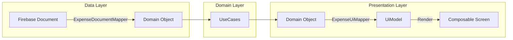

In our Clean Architecture approach, **Mappers** are the critical boundaries that decouple the layers of our application. They ensure that changes in one layer (e.g., a database schema change or a UI redesign) do not ripple through the entire codebase.

This document outlines why we use mappers, how data flows through them, and how we handle localization and formatting.

## Why Mappers are Mandatory

We never pass objects directly from the database to the screen. Instead, we transform data at each architectural boundary:

1.  **Decoupling:** The UI shouldn't know about Firebase `Timestamp` objects, and the Business Logic shouldn't care about formatted Strings like `"12 Jan"`.
2.  **Safety:** A database object might have nullable fields that the UI requires to be non-null. Mappers handle defaults and safety checks.
3.  **Testability:** By separating raw data from formatted data, we can unit test the logic (e.g., "does this currency format correctly?") without needing an Android Emulator.

## The Data Flow

### 1. Data Layer → Domain Layer (`DocumentMapper`)
**Purpose:** Abstraction of the Data Source.

When we fetch data from an external source (like Firestore), we receive a **Data Transfer Object (DTO)** or **Document**. These objects are often tied to the specific library (e.g., Firebase annotations, specific data types).

We map these immediately to **Domain Objects**.

* **Input:** `ExpenseDocument` (contains `com.google.firebase.Timestamp`, nullable fields, database IDs).
* **Output:** `Expense` (contains `java.time.LocalDateTime`, strict types, business-ready data).
* **Benefit:** If we switch from Firebase to SQL or a REST API later, our Domain layer (Use Cases) remains 100% untouched. We only change the Mapper.

### 2. Domain Layer → Presentation Layer (`UiMapper`)
**Purpose:** Preparation for Display.

The View (Compose) should be "dumb." It should not calculate dates, format currencies, or concatenate strings. It should only render what it is given. We map Domain Objects to **UiModels**.

* **Input:** `Expense` (Domain object with raw data: `amountCents = 1050`, `currency = "EUR"`).
* **Output:** `ExpenseUiModel` (Ready-to-print data: `formattedAmount = "10.50 €"`).
* **Benefit:** We can change how the date looks ("10/01/2025" vs "Jan 10") in the Mapper without touching the UI code or the business logic.




---

## Best Practices

### 1. The `LocaleProvider`
Formatting currencies and dates requires knowledge of the user's region (`Locale`). However, Mappers should be pure Kotlin classes and should **not** depend on the Android `Context`.

**Solution:**
We use a `LocaleProvider` interface.

This allows us to write Unit Tests for mappers by passing a fake provider (e.g., always forcing `Locale.ES`), ensuring tests pass on any machine regardless of system language.

### 2. Shared Formatting Logic (:core:design-system)
Since formatting (Dates, Currencies, Percentages) is needed across multiple features (Expenses, Balances, Profile), we should **not duplicate** this logic in every feature mapper.

**Strategy:**
Extract common formatting functions to the **`:core:design-system`** module (or a dedicated `core:ui-util` package).

* **Why:** This ensures consistency. If we decide to change the decimal separator or the date format, we change it in *one* place in the core module, and it automatically reflects in the `ExpenseItem`, `BalanceView`, and history logs.
* **Usage:** Feature-specific Mappers (`ExpenseUiMapper`) should delegate the heavy lifting to these shared helper functions.

```kotlin
// Example inside :core:design-system
object CurrencyFormatter {
    fun format(cents: Long, currencyCode: String, locale: Locale): String {
        // Shared logic...
    }
}
