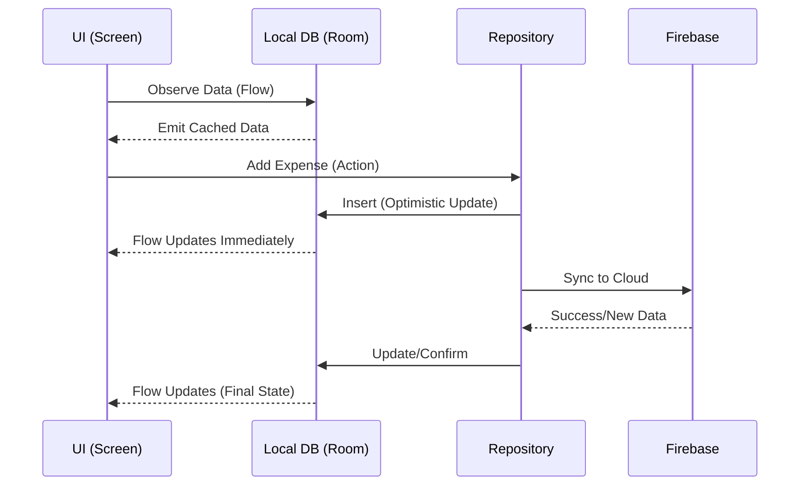

This page explains the advanced architectural patterns used to keep **ExpenseShareApp** loosely coupled. The core philosophy is that the **`:app` module should be a "dumb assembler"** that doesn't know the implementation details of the features it hosts.

## 1. The "Plugin" Pattern (Navigation Discovery)

In traditional apps, the `AppNavHost` hardcodes every feature:

```kotlin
// ❌ Traditional approach (Coupled)
NavHost(...) {
    expensesGraph()
    settingsGraph()
    groupsGraph() // Every time you add a feature, you edit this file.
}

```

In **ExpenseShareApp**, we use a **Discovery Pattern** powered by Koin.

### How it works

1. **The Contract:** We define `NavigationProvider` in `:core:design-system`.
2. **The Implementation:** Each feature module (e.g., `:features:groups`) implements this interface to define its own graph and (optionally) its Bottom Navigation tab.
3. **The Injection:** The feature module declares this implementation in its Koin module:
```kotlin
// In GroupsUiModule.kt
single { GroupsNavigationProviderImpl() } bind NavigationProvider::class

```


4. **The Discovery:** The `MainScreen` and `AppNavHost` simply ask Koin for **all** providers:
```kotlin
// In AppNavHost.kt
val allFeatures: List<NavigationProvider> = koin.getAll()

NavHost(...) {
    allFeatures.forEach { feature ->
        feature.registerGraph(this, navController)
    }
}

```


**Benefit:** You can add, remove, or disable entire feature modules without changing a single line of code in the `:app` module.

---

## 2. Dependency Injection Strategy

We organize Koin modules by **Layer**, not just by Screen. This ensures strict visibility rules.

| Module Type | Responsibility | Example Content |
| --- | --- | --- |
| **App Module** | The Assembler | Collects all other modules and starts Koin. |
| **Feature Module** | Presentation Logic | `ViewModels`, `NavigationProviders`, `ScreenUiProviders`. |
| **Domain Module** | Pure Business Logic | `UseCases`, `Repository Interfaces`. |
| **Data Module** | Implementation | `RepositoryImpls`, `DataSources` (Firebase/Room). |

### The "Binder" Pattern

Notice that Feature modules never see Data modules directly.

* **UI** asks for a `UseCase` (Domain).
* **UseCase** asks for a `Repository` Interface (Domain).
* **Koin** binds the `RepositoryImpl` (Data) to that Interface at runtime.

---

## 3. Offline-First Data Strategy

The app is designed to work offline using a **Single Source of Truth (SSOT)** pattern.

### The Flow

1. **Read:** The UI *always* observes the **Local Database** (Room) via `Flow`. It never waits for the Network to show data.
2. **Write:** User actions (e.g., "Add Expense") are written to the **Local Database** first.
3. **Sync:** A background operation (Repository or Worker) pushes the change to **Firebase**.
4. **Update:** When Firebase confirms the save (or sends new data), we update the Local Database.
5. **Refresh:** The `Flow` observing the Local Database emits the new data automatically.



This ensures the app feels **instant** even on slow networks.

---

## 📝 Checklist: Adding a New Feature

To leverage this architecture when creating a new module (e.g., `:features:stats`):

1. **Create Module:** Create the module and add `build.gradle.kts`.
2. **Implement Provider:** Create `StatsNavigationProviderImpl : NavigationProvider`.
3. **Setup DI:** Create `StatsUiModule` and declare the provider:
   `single { StatsNavigationProviderImpl() } bind NavigationProvider::class`.
4. **Register:** Add the module to `includes()` in `AppModule.kt` (or ensure it's loaded).
5. **Done:** The new screen will automatically appear in the app navigation.
