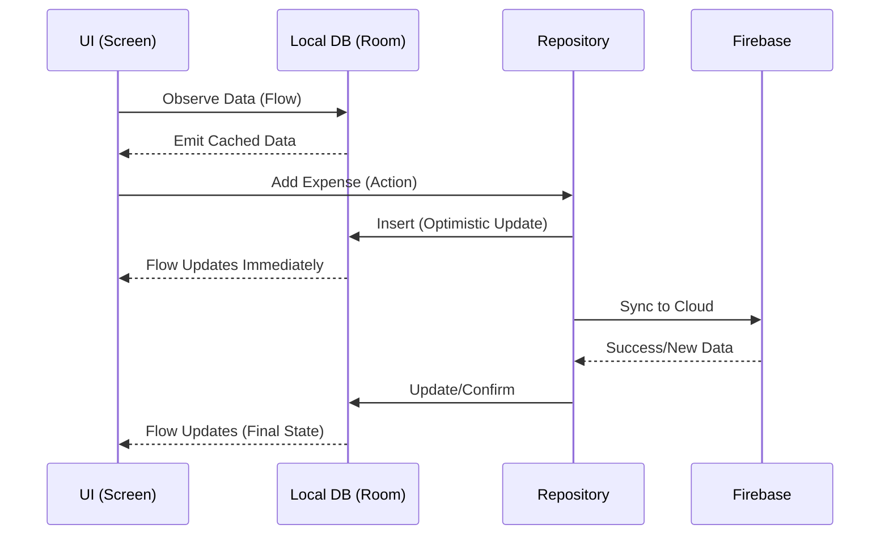

This page explains the advanced architectural patterns used to keep **SplitTrip** loosely coupled. The core philosophy is that the **`:app` module should be a "dumb assembler"** that doesn't know the implementation details of the features it hosts.

## 1. The "Plugin" Pattern (Navigation Discovery)

In traditional apps, the `AppNavHost` hardcodes every feature:

```kotlin
// ❌ Traditional approach (Coupled)
NavHost(...) {
    expensesGraph()
    settingsGraph()
    groupsGraph() // Every time you add a feature, you edit this file.
}

```

In **SplitTrip**, we use a **Discovery Pattern** powered by Koin.

### How it works

1. **The Contract:** We define `NavigationProvider` in `:core:design-system`.
2. **The Implementation:** Each feature module (e.g., `:features:groups`) implements this interface to define its own graph and (optionally) its Bottom Navigation tab.
3. **The Injection:** The feature module declares this implementation in its Koin module:
```kotlin
// In GroupsUiModule.kt
single { GroupsNavigationProviderImpl() } bind NavigationProvider::class

```


4. **The Discovery:** The `MainScreen` and `AppNavHost` simply ask Koin for **all** providers:
```kotlin
// In AppNavHost.kt
val allFeatures: List<NavigationProvider> = koin.getAll()

NavHost(...) {
    allFeatures.forEach { feature ->
        feature.buildGraph(this)
    }
}

```


**Benefit:** You can add, remove, or disable entire feature modules without changing a single line of code in the `:app` module.

---

## 2. Dependency Injection Strategy

We organize Koin modules by **Layer**, not just by Screen. This ensures strict visibility rules.

| Module Type | Responsibility | Example Content |
| --- | --- | --- |
| **App Module** | The Assembler | Collects all other modules and starts Koin. |
| **Feature Module** | Presentation Logic | `ViewModels`, `NavigationProviders`, `ScreenUiProviders`. |
| **Domain Module** | Pure Business Logic | `UseCases`, `Repository Interfaces`. |
| **Data Module** | Implementation | `RepositoryImpls`, `DataSources` (Firebase/Room). |

### The "Binder" Pattern

Notice that Feature modules never see Data modules directly.

* **UI** asks for a `UseCase` (Domain).
* **UseCase** asks for a `Repository` Interface (Domain).
* **Koin** binds the `RepositoryImpl` (Data) to that Interface at runtime.

---

## 3. Offline-First Data Strategy

The app is designed to work offline using a **Single Source of Truth (SSOT)** pattern.

### The Flow

1. **Read:** The UI *always* observes the **Local Database** (Room) via `Flow`. It never waits for the Network to show data.
2. **Write:** User actions (e.g., "Add Expense") are written to the **Local Database** first.
3. **Sync:** A background operation (Repository or Worker) pushes the change to **Firebase**.
4. **Update:** When Firebase confirms the save (or sends new data), we update the Local Database.
5. **Refresh:** The `Flow` observing the Local Database emits the new data automatically.


```mermaid
sequenceDiagram
    participant UI as UI (Screen)
    participant Local as Local DB (Room)
    participant Repo as Repository
    participant Cloud as Firebase

    UI->>Local: Observe Data (Flow)
    Local-->>UI: Emit Cached Data
    
    UI->>Repo: Add Expense (Action)
    Repo->>Local: Insert (Optimistic Update)
    Local-->>UI: Flow Updates Immediately
    
    Repo->>Cloud: Sync to Cloud
    Cloud-->>Repo: Success/New Data
    Repo->>Local: Update/Confirm
    Local-->>UI: Flow Updates (Final State)

```

This ensures the app feels **instant** even on slow networks.

---

## 4. Feature Module Extraction (Read vs. Write Separation)

As the app grew, feature modules accumulated both **read-only dashboard** logic and **complex write-flow** logic. This violated separation of concerns and slowed down Gradle builds. To address this, write-flows and management sub-features were extracted into standalone modules:

| Before | After |
|---|---|
| `:features:balances` (read + contributions + withdrawals) | `:features:balances` (read-only dashboard) |
| | `:features:contributions` (add contribution write-flow) |
| | `:features:withdrawals` (add cash withdrawal write-flow) |
| `:features:groups` (lifecycle + subunit management) | `:features:groups` (group lifecycle only) |
| | `:features:subunits` (subunit CRUD management) |

### Rationale

1. **Separation of Concerns:** Read-only projections (balance dashboard) and complex write operations (multi-step wizards with validation) are fundamentally different responsibilities. Isolating them prevents changes to transactional logic from triggering recompilation of display logic.
2. **Build Parallelisation:** Gradle builds modules in parallel. Extracting subunits, contributions, and withdrawals into their own modules enables concurrent compilation.
3. **Independent Entry Points:** Write-flows can be reached from deep links, notifications, or other entry points without depending on the entire parent module.

### The `TabGraphContributor` Pattern

Extracted non-tab modules don't appear in the bottom navigation bar — they are reachable only via `LocalTabNavController` from within an existing tab. Instead of implementing `NavigationProvider`, they implement `TabGraphContributor`:

```kotlin
// 1. Non-tab module defines its TabGraphContributor
class ContributionsTabGraphContributorImpl : TabGraphContributor {
    override fun contributeGraph(builder: NavGraphBuilder) {
        builder.contributionsGraph()
    }
}

// 2. Non-tab module registers it in Koin
factory { ContributionsTabGraphContributorImpl() } bind TabGraphContributor::class

// 3. Host tab's NavigationProvider merges contributed routes at runtime
class BalancesNavigationProviderImpl(
    private val graphContributors: List<TabGraphContributor> = emptyList()
) : NavigationProvider {
    override fun buildGraph(builder: NavGraphBuilder) {
        builder.balancesGraph()
        graphContributors.forEach { it.contributeGraph(builder) }
    }
}
```

This allows runtime route merging **without compile-time cross-feature dependencies**. The host tab (`:features:balances`) never imports anything from `:features:contributions` — it only depends on the `TabGraphContributor` interface from `:core:design-system`.

### Current TabGraphContributor Registrations

| Module | Contributor | Host Tab |
|---|---|---|
| `:features:contributions` | `ContributionsTabGraphContributorImpl` | `:features:balances` |
| `:features:withdrawals` | `WithdrawalsTabGraphContributorImpl` | `:features:balances` |
| `:features:subunits` | `SubunitsTabGraphContributorImpl` | `:features:groups` |

---

## 📝 Checklist: Adding a New Feature

To leverage this architecture when creating a new module (e.g., `:features:stats`):

1. **Create Module:** Create the module and add `build.gradle.kts`.
2. **Decide Pattern:**
   - If the feature is a **bottom navigation tab** → implement `NavigationProvider` (provides icon, label, order, `buildGraph()`).
   - If the feature is a **standalone write-flow** reached from within an existing tab → implement `TabGraphContributor` and have the host tab's `NavigationProvider` merge it.
3. **Implement Provider:** Create `StatsNavigationProviderImpl : NavigationProvider` or `StatsTabGraphContributorImpl : TabGraphContributor`.
4. **Setup DI:** Create `StatsUiModule` and declare the provider:
   - Tab: `single { StatsNavigationProviderImpl() } bind NavigationProvider::class`.
   - Non-tab: `factory { StatsTabGraphContributorImpl() } bind TabGraphContributor::class`.
5. **Register:** Add the module to `includes()` in `AppModule.kt` (or ensure it's loaded) and `settings.gradle.kts`.
6. **Done:** Tab features automatically appear in the navigation. Non-tab features are reachable via their host tab's graph.
