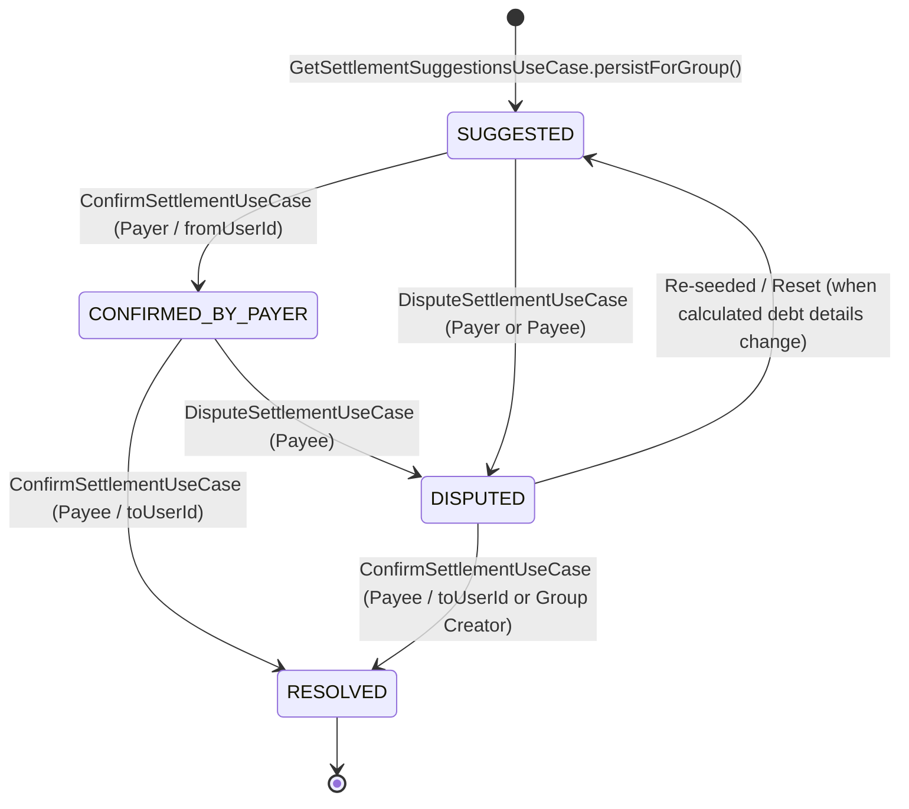

# Settlement Acknowledgment & Consensus Flow

## Overview

In **SplitTrip**, calculating net balances or simplified debts (via `DebtSimplificationService`) is an ephemeral, read-only calculation. However, real-world peer-to-peer debt settlements require **mutual consensus**: both the debtor (payer) and the creditor (payee) must acknowledge that money was actually sent and received before the settlement is marked as resolved and the debt cleared.

The **Settlement Acknowledgment & Consensus Flow** materializes debt simplification proposals into persistent `SettlementRecord` entities, tracks their lifecycle through a formal state machine (`SUGGESTED` → `CONFIRMED_BY_PAYER` → `RESOLVED`, with `DISPUTED` handling), and enforces settlement resolution invariants on trip lifecycle actions such as leaving a group or archiving a trip.

---

## 1. Domain Models & Enums

### 1.1 Ephemeral `Settlement` vs Persistent `SettlementRecord`

- **`Settlement`**: An ephemeral value object returned by `DebtSimplificationService`. It specifies *who owes whom*, *how much*, the *currency*, and the *source pocket* (`POCKET`, `CASH`, or `NET`).
- **`SettlementRecord`**: A persistent domain entity stored in Room and Firestore. It wraps a `Settlement` object along with status tracking (`SettlementStatus`) and audit timestamps (`createdAt`, `confirmedByPayerAt`, `confirmedByPayeeAt`, `resolvedAt`, `disputedBy`, `disputeReason`).

```kotlin
// domain/model/SettlementRecord.kt
data class SettlementRecord(
    val id: String,
    val groupId: String,
    val settlement: Settlement,
    val status: SettlementStatus,
    val createdAt: LocalDateTime,
    val confirmedByPayerAt: LocalDateTime? = null,
    val confirmedByPayeeAt: LocalDateTime? = null,
    val resolvedAt: LocalDateTime? = null,
    val disputedBy: String? = null,
    val disputeReason: String? = null
)
```

### 1.2 Enums

#### `SettlementStatus`

Represents the state of mutual consensus:

| Status | Meaning | Permitted Actor to Advance / Trigger |
|---|---|---|
| `SUGGESTED` | Materialized proposal generated from balances. | Debtor (`fromUserId`) confirms payment sent. |
| `CONFIRMED_BY_PAYER` | Debtor marked payment as sent. | Creditor (`toUserId`) confirms receipt. |
| `DISPUTED` | Either party flagged an issue (amount, non-receipt, invalid currency). | Creditor (`toUserId`) or group creator/admin (direct resolution to `RESOLVED`), or auto-reset on debt details change (to `SUGGESTED`). |
| `RESOLVED` | Final state. Settlement is complete and cleared. | Terminal state. |

#### `SettlementPocketType`

Identifies the origin pocket of the debt:

| Pocket Type | Origin | Currency Scope | Confirmation Policy |
|---|---|---|---|
| `POCKET` | Virtual currency pocket balance | Specific currency | Mutual consensus (`SUGGESTED` → `CONFIRMED_BY_PAYER` → `RESOLVED`) |
| `CASH` | Cash tranche balance | Specific currency | Direct payee resolution or mutual flow |
| `NET` | Post-simplification net balance | Group primary currency | Mutual consensus or direct resolution |

---

## 2. Mutual Consensus State Machine

The mutual consensus lifecycle is governed by strict caller-identity checks implemented in `ConfirmSettlementUseCaseImpl` and `DisputeSettlementUseCaseImpl`.



### 2.1 State Transition Validation Rules

1. **`SUGGESTED` → `CONFIRMED_BY_PAYER`**:
   - **Allowed Actor**: `fromUserId` (the payer/debtor).
   - **Enforcement**: `require(currentUserId == record.settlement.fromUserId)` in `ConfirmSettlementUseCaseImpl`.
   - **Effect**: Sets `status = CONFIRMED_BY_PAYER` and updates `confirmedByPayerAt`.

2. **`CONFIRMED_BY_PAYER` → `RESOLVED`**:
   - **Allowed Actor**: `toUserId` (the payee/creditor).
   - **Enforcement**: `require(currentUserId == record.settlement.toUserId)` in `ConfirmSettlementUseCaseImpl`.
   - **Effect**: Sets `status = RESOLVED`, populates `confirmedByPayeeAt` and `resolvedAt`.

3. **Any non-`RESOLVED` state → `DISPUTED`**:
   - **Allowed Actor**: Either `fromUserId` or `toUserId`.
   - **Enforcement**: `require(isPayer || isPayee)` and `require(status != RESOLVED)` in `DisputeSettlementUseCaseImpl`.
   - **Effect**: Sets `status = DISPUTED`, records `disputedBy = currentUserId` and `disputeReason`.

4. **`DISPUTED` → `RESOLVED` (Direct Resolution)**:
   - **Allowed Actor**: `toUserId` (the payee/creditor) or the group creator.
   - **Enforcement**: `require(isPayee || isCreator)` in `ConfirmSettlementUseCaseImpl`.
   - **Effect**: Sets `status = RESOLVED`, populates `confirmedByPayeeAt` and `resolvedAt`.

5. **`DISPUTED` → `SUGGESTED` (Re-seed / Reset)**:
   - **Trigger**: Debt details (e.g., amount, currency) change due to expense/contribution updates during reconciliation.
   - **Enforcement**: Handled automatically in `GetSettlementSuggestionsUseCaseImpl`.
   - **Effect**: Resets `status = SUGGESTED`, clears `disputedBy = null` and `disputeReason = null`, and updates details.

---

## 3. Pocket-Type Confirmation Matrix

| Pocket Type | `SUGGESTED` Payer Confirmation | `CONFIRMED_BY_PAYER` Payee Confirmation | Dispute Handling |
|---|---|---|---|
| **`POCKET`** | Mandatory | Mandatory | Allowed by either party until `RESOLVED`. |
| **`CASH`** | Mandatory / Optional direct | Mandatory | Allowed by either party until `RESOLVED`. |
| **`NET`** | Mandatory | Mandatory | Allowed by either party until `RESOLVED`. |

---

## 4. Settlement Seeding & Idempotency Contract

Settlements are created via `GetSettlementSuggestionsUseCase.persistForGroup(groupId)` when users navigate to the Balances screen or initiate group teardown (Leave / Archive).

### Idempotency Contract

1. Fetches active balances and runs `DebtSimplificationService.simplify()`.
2. Fetches existing `SettlementRecord`s for the group via `settlementRepository.getGroupSettlements(groupId)`.
3. Compares generated proposals against existing records:
   - If a non-`RESOLVED` record exists for the same `(fromUserId, toUserId, sourcePocket, currency)` tuple, the existing record is **retained** without modifying its state or timestamps.
   - If no active record exists, a new `SettlementRecord` is created with status `SUGGESTED`.
4. Obsolete `SUGGESTED` records whose underlying debt no longer exists are cleaned up.

---

## 5. Gate Enforcement (Leave & Archive Flows)

Rather than checking raw floating balances (`totalBalance == 0`), group teardown operations gate explicitly on **unresolved settlement records**. This prevents members from leaving while a payment confirmation is pending.

### 5.1 Leave Group Gate (`LeaveGroupUseCaseImpl`)

Before allowing a member to leave:
1. Calls `GetSettlementSuggestionsUseCase.persistForGroup(groupId)` to materialize any unpersisted suggestions.
2. Calls `AreMemberSettlementsResolvedUseCase(groupId, userId)`.
3. If any unresolved settlements (`status != RESOLVED`) involve `userId` (as `fromUserId` or `toUserId`), `LeaveGroupUseCaseImpl` throws `UnresolvedSettlementsException(groupId, pendingSettlements)`.

### 5.2 Archive Group Gate (`ArchiveGroupUseCaseImpl`)

Before archiving a group:
1. Calls `GetSettlementSuggestionsUseCase.persistForGroup(groupId)` to materialize final suggestions.
2. Calls `AreGroupSettlementsResolvedUseCase(groupId)`.
3. If any unresolved settlements remain in the group, `ArchiveGroupUseCaseImpl` throws `UnresolvedSettlementsException(groupId, pendingSettlements)`.

---

## 6. Unregistered Members & Unilateral Resolution

Unregistered members (users whose IDs start with the `pending_` prefix) cannot log in and therefore cannot participate in the mutual consensus flow. To prevent deadlocks during group teardown, the state machine supports two unilateral resolution exceptions when one party is an unregistered member:

1. **Unregistered Payee (Auto-Resolve)**: When the registered payer confirms a `SUGGESTED` or `CONFIRMED_BY_PAYER` settlement, it bypasses the mutual consensus requirements and transitions directly to `RESOLVED`.
2. **Unregistered Payer (Force-Resolve)**: When the registered payee confirms a `SUGGESTED` or `CONFIRMED_BY_PAYER` settlement, it force-resolves the settlement directly to `RESOLVED`.

---

## 7. Offline-First Architecture & Data Flow

`SettlementRepositoryImpl` strictly follows the project's offline-first sync pattern:

1. **Read Path**: The UI observes Room (`LocalSettlementDataSource`) via `getGroupSettlementsFlow(groupId)`.
2. **Cloud Sync**: `SettlementRepositoryImpl` uses `KeyedSubscriptionTracker` to maintain Firestore snapshot listeners (`groups/{groupId}/settlements/{settlementId}`) and `subscribeAndReconcile` to update local Room storage.
3. **Write Path**: State updates (`ConfirmSettlementUseCase`, `DisputeSettlementUseCase`) write to Room first, then trigger background cloud writes via `syncCreateToCloud()`.

---

## 8. Cloud Functions & FCM Notifications

When a `SettlementRecord` status changes in Firestore:
1. The `onSettlementStatusUpdated` Cloud Function is triggered.
2. Formats a localized FCM push notification:
   - `CONFIRMED_BY_PAYER`: Notifies `toUserId` ("*Member X marked payment of $Y as sent. Please confirm receipt.*").
   - `DISPUTED`: Notifies the counterparty ("*Member X disputed the settlement proposal.*").
   - `RESOLVED`: Notifies `fromUserId` ("*Member Y confirmed receipt of your payment.*").

---

## 9. Future Integrations

- **Auto-Contribution Materialization (#1310)**: When a `POCKET` or `NET` settlement reaches `RESOLVED` status, an automated `Contribution` record will be created to formally increase the payee's contribution pool (deferred to #1310).
