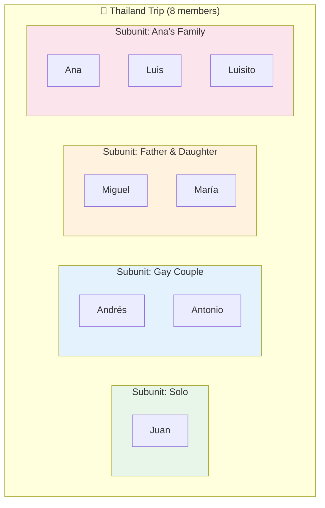
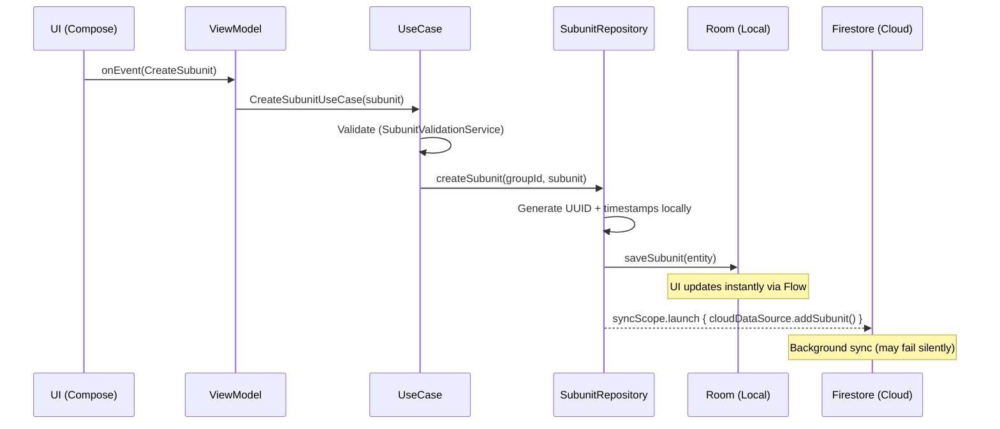
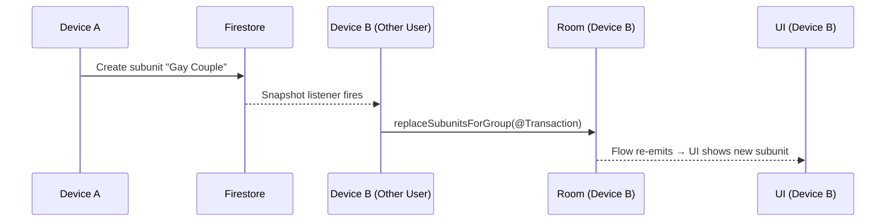
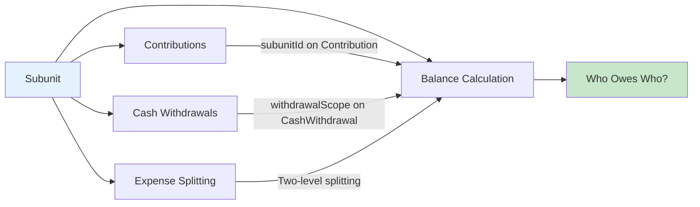
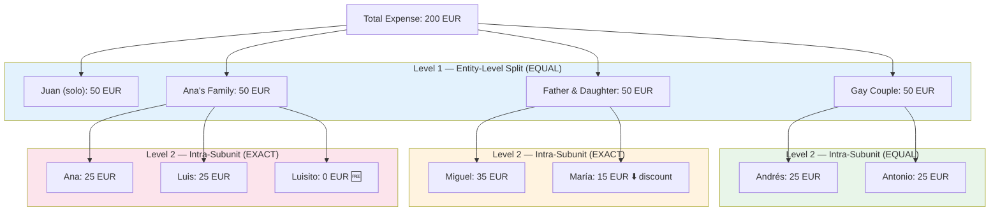
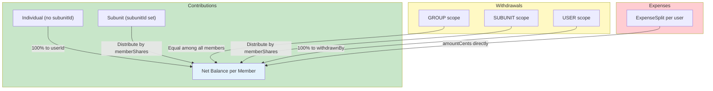
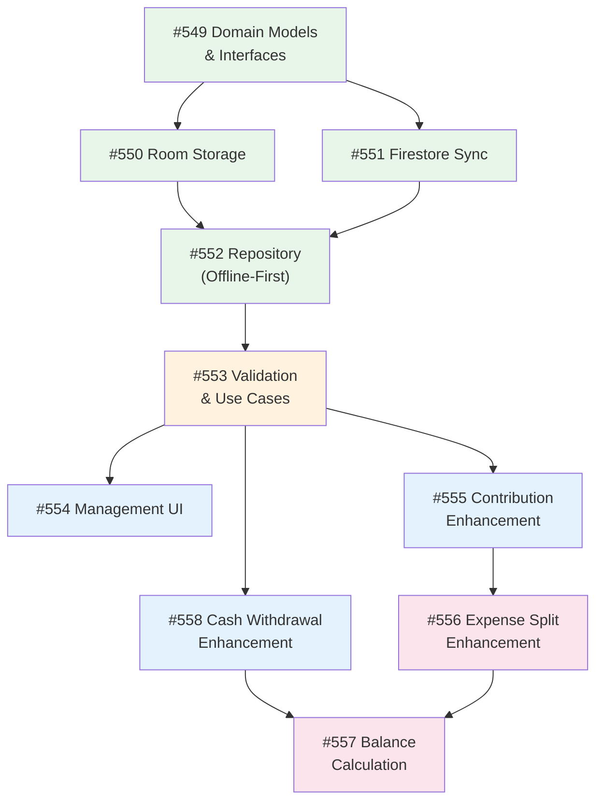

# Subunits & Group Composition

Travel groups are rarely just a flat list of individuals. In reality, groups are composed of **subunits** — couples, families, parents with children, or solo travelers. This document explains the subunit concept, its architecture, and how it affects every financial operation in the app: contributions, cash withdrawals, expense splitting, and balance calculation.

## The Problem: Flat Groups Don't Reflect Reality

Consider 8 friends traveling to Thailand together:

| Person | Traveling as |
|---|---|
| Juan | Solo |
| Andrés + Antonio | Couple |
| Miguel + María | Father + daughter |
| Ana + Luis + Luisito | Family of 3 |

Without subunits, every financial operation treats all 8 people identically. But in practice:

- **Andrés** often contributes on behalf of **Antonio** ("I'll add 100 EUR for both of us").
- **Ana** withdraws cash to buy souvenirs for her family, not for the whole group.
- **Luisito** (age 10) gets free admission to the water park — splitting equally is wrong.
- At the end of the trip, "who owes whom" must account for these relationships.

## The Solution: Subunits

A **subunit** is a logical grouping of members within a travel group. It models the real-world relationships between travelers.



### Key Design Rules

| Rule | Rationale |
|---|---|
| **One subunit per member per group** | A person can't be in two families simultaneously. |
| **Subunits are optional** | Solo travelers don't need one. Groups work identically without subunits. |
| **Subunits have a name** | Human-readable identifier (e.g., "Gay Couple", "Ana's Family"). |
| **Members have weight shares** | `memberShares: Map<String, BigDecimal>` — defaults to equal weights, customizable. |

### The `memberShares` Map

Each subunit defines how its internal costs are distributed by default. The shares are **weight ratios** that sum to `1.0`:

| Subunit | memberShares | Interpretation |
|---|---|---|
| Gay Couple | `{Andrés: 0.5, Antonio: 0.5}` | Equal — both adults |
| Father & Daughter | `{Miguel: 0.6, María: 0.4}` | 60/40 — parent pays more |
| Ana's Family | `{Ana: 0.4, Luis: 0.4, Luisito: 0.2}` | Kid pays less by default |

> **Important:** `memberShares` is the **default** distribution. It can be **overridden per expense** (see [Two-Level Expense Splitting](#two-level-expense-splitting) below).

---

## Domain Model

```kotlin
data class Subunit(
    val id: String = "",
    val groupId: String = "",
    val name: String = "",
    val memberIds: List<String> = emptyList(),
    val memberShares: Map<String, BigDecimal> = emptyMap(),
    val createdBy: String = "",
    val createdAt: LocalDateTime? = null,
    val lastUpdatedAt: LocalDateTime? = null
)
```

The model is intentionally simple — members are embedded directly (not a separate entity) because subunits are small (typically 2–5 people).

### Validation Rules

The `SubunitValidationService` enforces these business rules:

| Rule | Error |
|---|---|
| Name must not be blank | `EMPTY_NAME` |
| At least 1 member required | `NO_MEMBERS` |
| All members must belong to the group | `MEMBER_NOT_IN_GROUP` |
| A member cannot appear in another subunit | `MEMBER_ALREADY_IN_SUBUNIT` |
| Share weights must sum to 1.0 (±0.001 tolerance) | `SHARES_DO_NOT_SUM` |
| Every member in `memberIds` must have a `memberShares` entry | `MISSING_SHARE` |

**Auto-normalization:** When `memberShares` is empty but `memberIds` is populated, the system auto-generates equal shares (e.g., 2 members → `{userA: 0.5, userB: 0.5}`).

---

## Data Architecture

Subunits follow the same offline-first protocol as contributions and expenses.

### Storage

| Layer | Structure | Path |
|---|---|---|
| **Firestore** | Subcollection | `groups/{groupId}/subunits/{subunitId}` |
| **Room** | Table with FK | `subunits` table → `groupId` FK to `groups` |

### Offline-First Flow



### Real-Time Sync

Other users/devices see subunit changes in near real-time via the snapshot listener pattern:



### Group Deletion Cleanup

Firestore does **NOT** auto-delete subcollections. When a group is deleted, the repository must delete all subunit documents **before** the group document — otherwise the snapshot listener on other devices never fires and the deleted group remains visible.

---

## How Subunits Affect Financial Operations

Subunits touch four core financial operations. Each works differently:



---

## 1. Contributions (Adding Money to the Pot)

A member can contribute money to the group pot **on behalf of their subunit**.

### The Three Scenarios

| Scenario | `subunitId` | Example |
|---|---|---|
| **Individual** | `null` | Andrés adds 50 EUR for himself |
| **Subunit** | `"subunit-123"` | Andrés adds 100 EUR for the couple (50 + 50) |

> There is no "group-level contribution" concept — contributions are always by a person, optionally on behalf of a subunit.

### Domain Model Change

```kotlin
data class Contribution(
    val id: String = "",
    val groupId: String = "",
    val userId: String = "",       // Who physically added the money
    val subunitId: String? = null, // On behalf of which subunit (if any)
    val amount: Long = 0,
    val currency: String = "EUR",
    val createdAt: LocalDateTime? = null,
    val lastUpdatedAt: LocalDateTime? = null
)
```

### UI Behavior

When the user belongs to a subunit, the Add Contribution dialog shows:

```
┌──────────────────────────────────┐
│  Add Contribution                │
│                                  │
│  Amount: [100.00] EUR            │
│                                  │
│  Contributing for:               │
│  ○ For me (Andrés)               │
│  ● For Gay Couple (2 people)     │
│     Hint: 2 × 50 EUR = 100 EUR  │
│                                  │
│  [Add Contribution]              │
└──────────────────────────────────┘
```

If the user is NOT in any subunit, the dialog works exactly as today.

### Balance Attribution

- **Individual contribution (100 EUR, no subunitId):** 100 EUR attributed to Andrés.
- **Subunit contribution (100 EUR, subunitId = couple):** 50 EUR attributed to Andrés, 50 EUR attributed to Antonio (based on `memberShares: 50/50`).

---

## 2. Cash Withdrawals (Taking Cash from the ATM)

Cash withdrawals carry a **scope** indicating who the cash is intended for. The existing `PayerType` enum models these three scopes perfectly:

### The Three Scopes

| Scope | `withdrawalScope` | `subunitId` | Example |
|---|---|---|---|
| **Group** | `GROUP` | `null` | Withdraw 200 EUR for water park tickets (all 8 people) |
| **Subunit** | `SUBUNIT` | `"subunit-123"` | Withdraw 50 EUR for souvenirs (Antonio & me) |
| **Individual** | `USER` | `null` | Withdraw 5 EUR for a coffee (just me) |

### Domain Model Change

```kotlin
data class CashWithdrawal(
    val id: String = "",
    val groupId: String = "",
    val withdrawnBy: String = "",              // Who physically withdrew
    val withdrawalScope: PayerType = PayerType.GROUP,  // For whom
    val subunitId: String? = null,             // Only when scope = SUBUNIT
    val amountWithdrawn: Long = 0,
    val remainingAmount: Long = 0,
    val currency: String = "EUR",
    val deductedBaseAmount: Long = 0,
    val exchangeRate: BigDecimal = BigDecimal.ONE,
    val createdAt: LocalDateTime? = null,
    val lastUpdatedAt: LocalDateTime? = null
)
```

### Why Simple Splitting Is Enough for Withdrawals

Unlike expenses (which need complex per-person splitting — see below), cash withdrawals use simple attribution:

| Scope | Attribution Strategy |
|---|---|
| `GROUP` | `deductedBaseAmount` split **equally** among all group members |
| `SUBUNIT` | `deductedBaseAmount` distributed among subunit members by **`memberShares`** |
| `USER` | `deductedBaseAmount` attributed entirely to `withdrawnBy` |

The rationale: a withdrawal is about **who the cash is for**, not about itemized cost attribution. When the cash is actually spent (on water park tickets, souvenirs, etc.), the **expense** determines the per-person breakdown. The withdrawal just says "I took out 200 EUR for the group."

### UI Behavior

When the user belongs to a subunit and the group has subunits:

```
┌──────────────────────────────────┐
│  Withdraw Cash                   │
│                                  │
│  Amount: [200.00] THB            │
│  Deducted: [54.05] EUR           │
│                                  │
│  Withdrawing for:                │
│  ● For the group                 │
│  ○ For Gay Couple                │
│  ○ For me (personal)             │
│                                  │
│  [Withdraw]                      │
└──────────────────────────────────┘
```

---

## 3. Two-Level Expense Splitting

This is the most architecturally significant change. When subunits exist, expense splitting operates at **two independent levels**, and **both levels support all three split strategies** (EQUAL, EXACT, PERCENT).

### The Two Levels



### Level 1: Entity-Level Split

**Question:** How is the total expense divided among "entities" (solo travelers + subunits as single units)?

The system treats each subunit as **one participant**. Solo travelers are individual participants. The total is divided among these entities using the standard split strategies:

- **EQUAL:** 200 EUR ÷ 4 entities = 50 EUR each
- **EXACT:** Juan 30 EUR, Couple 60 EUR, Father+Daughter 50 EUR, Family 60 EUR
- **PERCENT:** Juan 15%, Couple 30%, Father+Daughter 25%, Family 30%

### Level 2: Intra-Subunit Split

**Question:** How is each subunit's share divided among its members?

This is configured **independently per subunit, per expense**. The `Subunit.memberShares` is the default, but the user can override it:

| Subunit | Default (`memberShares`) | Override for this expense | Reason |
|---|---|---|---|
| Gay Couple | 50/50 | EQUAL (use default) | Both adults, same price |
| Father & Daughter | 60/40 | EXACT: Miguel 35, María 15 | María gets under-18 discount |
| Ana's Family | 40/40/20 | EXACT: Ana 25, Luis 25, Luisito 0 | Luisito is under 12, free entry |

### Practical Example: Water Park Tickets

> The group visits a water park. Total cost: 200 EUR.
> - Adults pay 30 EUR each.
> - Kids under 18 pay 15 EUR.
> - Kids under 12 are free.

**Step 1: Entity-level split (EXACT)**

| Entity | Amount | Calculation |
|---|---|---|
| Juan (solo, adult) | 30 EUR | Single ticket |
| Gay Couple (2 adults) | 60 EUR | 2 × 30 EUR |
| Father & Daughter (adult + teen) | 45 EUR | 30 + 15 EUR |
| Ana's Family (2 adults + child) | 65 EUR | 30 + 30 + 5 EUR *(oops, Luisito wasn't quite free at this park)* |
| **Total** | **200 EUR** | |

**Step 2: Intra-subunit split (per subunit)**

| Subunit | Strategy | Distribution |
|---|---|---|
| Gay Couple | EQUAL | Andrés 30, Antonio 30 |
| Father & Daughter | EXACT | Miguel 30, María 15 |
| Ana's Family | EXACT | Ana 30, Luis 30, Luisito 5 |

**Final stored `ExpenseSplit` entries (flat, per-user):**

| userId | amountCents | subunitId |
|---|---|---|
| Juan | 3000 | `null` |
| Andrés | 3000 | `subunit-couple` |
| Antonio | 3000 | `subunit-couple` |
| Miguel | 3000 | `subunit-father` |
| María | 1500 | `subunit-father` |
| Ana | 3000 | `subunit-family` |
| Luis | 3000 | `subunit-family` |
| Luisito | 500 | `subunit-family` |

> **Key insight:** The stored `ExpenseSplit` entries are **always flat** (one per user). The two-level splitting is a **calculation and UI concern** — the `SubunitAwareSplitService` produces a flat `List<ExpenseSplit>` for storage.

### The `SubunitAwareSplitService`

This domain service orchestrates the two-level split:

```kotlin
class SubunitAwareSplitService(
    private val splitCalculatorFactory: ExpenseSplitCalculatorFactory
) {
    fun calculateShares(
        totalAmountCents: Long,
        individualParticipantIds: List<String>,
        subunits: List<Subunit>,
        entitySplitType: SplitType,
        entitySplits: List<EntitySplit> = emptyList(),
        subunitSplitOverrides: Map<String, SubunitSplitOverride> = emptyMap()
    ): List<ExpenseSplit>
}
```

**Algorithm:**
1. Build entity list: solo user IDs + subunit IDs.
2. Use `ExpenseSplitCalculator` (via factory) to compute entity-level shares.
3. For each subunit's share:
   - Check `subunitSplitOverrides[subunitId]` for per-expense override.
   - If override exists → use the override's `splitType` and per-member amounts.
   - If no override → distribute using `Subunit.memberShares` proportionally.
4. Set `subunitId` on each expanded split.
5. Return flat `List<ExpenseSplit>`.

### Supporting Domain Models

```kotlin
/** Entity-level share (Level 1) — one entry per solo user or subunit */
data class EntitySplit(
    val entityId: String,          // userId for solo, subunitId for subunits
    val amountCents: Long = 0,
    val percentage: BigDecimal? = null
)

/** Per-subunit Level 2 override */
data class SubunitSplitOverride(
    val splitType: SplitType,                    // EQUAL, EXACT, or PERCENT
    val memberSplits: List<ExpenseSplit> = emptyList()  // Per-member details
)
```

### UI: The Split Editor with Subunits

When "Split by subunit" is active, the split editor becomes a **two-level accordion**:

```
┌─────────────────────────────────────────────────┐
│  Split Type: [EXACT ▼]                          │
│                                                 │
│  👤 Juan                              30.00 EUR │
│                                                 │
│  ▼ 👥 Gay Couple                      60.00 EUR │
│  ┌─────────────────────────────────────────────┐│
│  │  Split within: [EQUAL ▼]                    ││
│  │  👤 Andrés                        30.00 EUR ││
│  │  👤 Antonio                       30.00 EUR ││
│  └─────────────────────────────────────────────┘│
│                                                 │
│  ▶ 👥 Father & Daughter               45.00 EUR │
│    (tap to expand and customize split)          │
│                                                 │
│  ▼ 👨‍👩‍👦 Ana's Family                    65.00 EUR │
│  ┌─────────────────────────────────────────────┐│
│  │  Split within: [EXACT ▼]                    ││
│  │  👤 Ana                           30.00 EUR ││
│  │  👤 Luis                          30.00 EUR ││
│  │  👤 Luisito                        5.00 EUR ││
│  └─────────────────────────────────────────────┘│
│                                                 │
│  Total: 200.00 EUR ✓                            │
└─────────────────────────────────────────────────┘
```

The user can toggle between **"Split by person"** (flat, current behavior — 8 individual rows) and **"Split by subunit"** (entity-level with expandable subunits).

---

## 4. Balance Calculation: Who Owes Who?

The ultimate purpose of subunits is to answer **"who owes whom"** correctly. The balance calculation must account for three sources of financial activity:

### The Balance Equation

```
netBalance[user] = effectiveContributions - effectiveWithdrawals - expenseSplitDebts
```

### Attribution Rules



#### Contributions Attribution

| Type | Logic |
|---|---|
| `subunitId == null` | Attribute `amount` entirely to `userId` |
| `subunitId != null` | Distribute `amount` among subunit members by `memberShares` |

**Example:** Andrés contributes 100 EUR for the couple (50/50 shares):
- Andrés effective contribution: 50 EUR
- Antonio effective contribution: 50 EUR

#### Cash Withdrawal Attribution

| Scope | Logic |
|---|---|
| `GROUP` | `deductedBaseAmount` ÷ total group members (equal) |
| `SUBUNIT` | `deductedBaseAmount` × `memberShare` per subunit member |
| `USER` | `deductedBaseAmount` entirely to `withdrawnBy` |

**Example:** Andrés withdraws 10,000 THB (deducted 270 EUR) for the couple:
- Andrés effective withdrawal: 135 EUR
- Antonio effective withdrawal: 135 EUR

#### Expense Split Attribution

Expense splits are **already per-user** with exact `amountCents`. The two-level splitting was resolved at expense creation time by `SubunitAwareSplitService`. At balance time, simply sum `amountCents` per `userId`.

### Complete Balance Example

After a day of activities:

| Event | Type | Details |
|---|---|---|
| Everyone contributes 50 EUR | 8 individual contributions | 50 EUR × 8 = 400 EUR pot |
| Andrés contributes 100 EUR for couple | Subunit contribution | 50 + 50 EUR attributed |
| Andrés withdraws 200 EUR for group | GROUP withdrawal | 25 EUR per person |
| Andrés withdraws 50 EUR for couple | SUBUNIT withdrawal | 25 EUR each |
| Andrés withdraws 5 EUR for himself | USER withdrawal | 5 EUR to Andrés |
| Water park 200 EUR (EXACT splits) | Expense | See per-user splits above |

**Resulting balances:**

| Member | Contributed | Withdrawn | Owes (splits) | Net Balance |
|---|---|---|---|---|
| Juan | 50 | 25 | 30 | **-5** |
| Andrés | 100 (50 own + 50 subunit) | 55 (25 group + 25 subunit + 5 personal) | 30 | **+15** |
| Antonio | 50 (from subunit) | 25 (from subunit) | 30 | **-5** |
| Miguel | 50 | 25 | 30 | **-5** |
| María | 50 | 25 | 15 | **+10** |
| Ana | 50 | 25 | 30 | **-5** |
| Luis | 50 | 25 | 30 | **-5** |
| Luisito | 50 | 25 | 5 | **+20** |

> Members with **positive** balances are owed money. Members with **negative** balances owe money.

---

## The Existing Hooks

The codebase was designed with subunits in mind from the start. These scaffolding hooks already exist:

| Hook | Location | Purpose |
|---|---|---|
| `PayerType.SUBUNIT` | `:domain/enums/PayerType.kt` | Third payer type alongside `USER` and `GROUP` |
| `ExpenseSplitDocument.subunitId` | `:data:firebase` | Firestore field ready for subunit tracking on splits |
| `ExpenseSplitDocument.subunitRef` | `:data:firebase` | Firestore document reference for the subunit |
| `ExpenseSplit.isCoveredById` | `:domain/model/ExpenseSplit.kt` | "One user covers another" pattern |
| `ActivityType.SUBGROUP_*` | `:domain/enums/ActivityType.kt` | Activity log types: `CREATED`, `UPDATED`, `DELETED` |
| `SubunitDocument.kt` | `:data:firebase` | Firestore document scaffolding with `memberShares` |
| `SubunitMemberDocument.kt` | `:data:firebase` | Companion member document scaffolding |

---

## Implementation Phases

The subunit feature is implemented in 10 phases with strict dependency order:



| Phase | Issue | Module | Description |
|---|---|---|---|
| 1 | #549 | `:domain` | `Subunit` model, repository & data source interfaces |
| 2 | #550 | `:data:local` | Room entity, DAO, migration, local data source impl |
| 3 | #551 | `:data:firebase` | Firestore documents, cloud data source, document mappers |
| 4 | #552 | `:data` | `SubunitRepositoryImpl` with offline-first sync |
| 5 | #553 | `:domain` | `SubunitValidationService` + CRUD use cases |
| 6 | #554 | `:features:subunits` | Subunit management UI (create, view, edit, delete) |
| 7 | #555 | `:features:contributions` | Contribute on behalf of subunit |
| 8 | #558 | `:features:withdrawals` | Withdraw cash with scope (GROUP/SUBUNIT/USER) |
| 9 | #556 | `:features:expenses` | Two-level subunit-aware expense splitting |
| 10 | #557 | `:features:balances` | Per-member balance calculation with subunit attribution |

---

## Edge Cases & Backward Compatibility

### Groups Without Subunits

When no subunits exist, every operation works **exactly as it does today**:
- Contributions have no `subunitId` → attributed to the individual.
- Cash withdrawals default to `GROUP` scope → split equally.
- Expenses split among individual participants → no Level 2 expansion.
- Balance calculation sums individual contributions and splits.

### Adding Subunits to an Existing Group

Subunits can be created at any point during a trip. Historical expenses/contributions are unaffected — they were already saved with flat per-user data. Only new operations can leverage subunits.

### Removing a Member from a Subunit

If a member is removed from a subunit:
- Historical splits with their `subunitId` remain valid (they still have `userId` + `amountCents`).
- Future operations no longer associate them with that subunit.
- The `memberShares` of remaining members should be re-normalized.

### Deleting a Subunit

When a subunit is deleted:
- Historical contributions with that `subunitId` retain their attribution (the per-user amounts were already computed).
- Historical expense splits retain their `subunitId` for audit trail purposes.
- The subunit's Firestore subcollection documents must be deleted before the group document (per the subcollection cleanup rule).

### Solo Travelers

Solo travelers do **not** need to be in a subunit. A person without a subunit:
- Always participates as an individual entity at Level 1.
- Cannot make subunit contributions or subunit withdrawals.
- Is treated identically to the current (pre-subunit) behavior.

